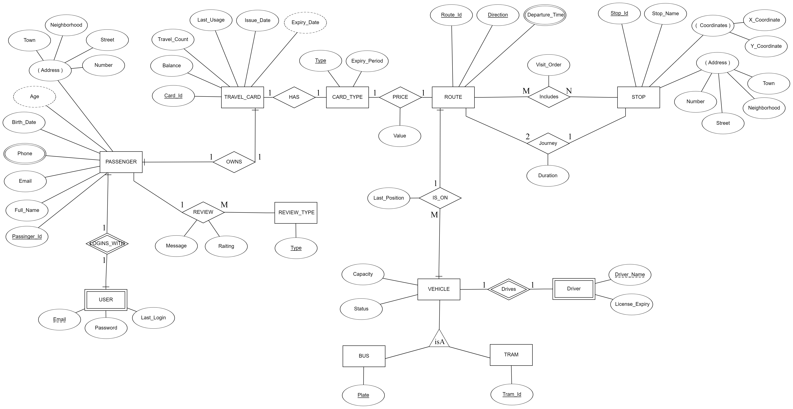
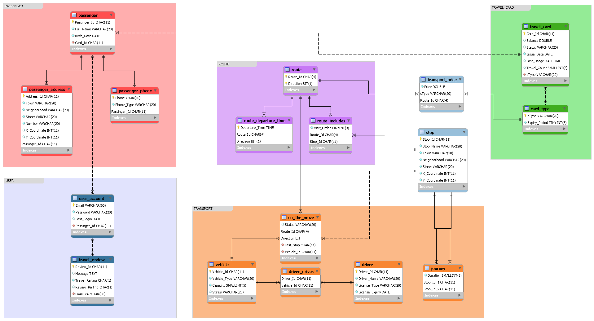

# Public Transportation System

PTS is an assistant application for public transportation.
PTS offers many functions which will help you to deal with many public transportation problems.
The application can be easily used by people of all ages and status, and soon will be the best assistant of public transport passengers.
With the help of PTS:
*	Users can find out the addresses of the bus and tram stations in their city.
*	Users can find out the bus and tram departure times.
*	Users can see the bus and tram routes their city.
*	Users can find bus or tram stations closest to them.
*	Users can learn the estimated arrival time of the vehicle coming to their stations.
*	Users can learn estimated travel times.
*	Users can learn the vehicle's operating / malfunction status.
*	Users can learn the capacity of the vehicle.
*Users will have private account reached via email and secured by a password.	
*	Users can learn the balance of their travel card.
*	Users can learn about their travel cards expiry date.
*	Users can see the total number of travels.
*	Users can see the total travel costs.
*	Users can see the cost of travel and if they can receive a transfer discount.
*	Users can leave a comment and rating for their travel.

## Requirement Analysis

The application needs a comprehensive database to perform its functions.
Database must store elementary type information such as integer or string and support read and write for the information.
The information in database is about users and city transportation. The database will be accessed by administrators and users.
Administrators access the database to enter city transportation information. Users will access the database through the application.
The information which will stored in database is detailed below:
1.	System must keep user information such as unique id, full name, email address, phone number which one user can have more than one phone number and an address that composed of town, neighborhood, street and number.
2.	System must keep email and password information for user to login. User login information has a meaning only if there is a user.
3.	Users have travel cards for public transportation. Travel cards has unique ids and belongs only one passenger. System needs to store their card type to determine transportation cost. System should store balance information, so users can see their balance. System should store last card usage so passengers can see if they can take a discount and amount of discount.
4.	In the city there are lot of stops so system must store them with a unique id and a name.  Some stops are used by either bus or tram and some of them is using by both. Moreover, users may want to see where the nearest stop is, and which trams or busses they can take from there. Therefore, system must store x and y coordinates of stops. For giving directions to user, system must store stop address that composed of town, neighborhood, street and number.
5.	In our system routes are defined by ordered stops. System must store all stops in routes including starting and ending stops. A route is bidirectional so system must store direction. System must store departure time. A route is unique with its name and direction.
6.	To give a user an estimated time on the arrival time or travel time of the bus, system must store the 1st stop, 2nd stop, route name, direction and duration information.
7.	Passengers can use tram or bus. Buses and trams have commonalities under vehicle. Vehicles have a specific route, and users could be access last station of any vehicle. Vehicles have capacity and status. But in difference buses have a unique plate and trams have a unique tramid.
8.	Users should pay their journey with their cards and system must store price and retrieve the price with type of the card and which route has took.
9.	Some cards have priorities like student or elder. But like everything beautiful has an end, they have an expiry date. System should store expiry duration of different types of cards.
10.	System must store information about drivers of all vehicles like full name, license number and license issue date of driver.
11.	Users can leave a comment and rating so system must store user rating and comment.




### Running

* Create executable for project.
```
mvn package
```
* PTS.jar under target is executable form of project.

Instructions :

1- Either
     Double click on 
     public-transportation-system/target/PTS.jar file
   Or
     Run src/main/java/Control/Launcher.java
     From cmd or idea

2- Fill the text fields for connection
   (Default is : root/nopassword/3306 
    because these are my configurations)

3- Click on Connect button to establish the connection
   (If the database is not created
    3.1- Click on CreateDB Button
    3.2- Click on InsertDB Button)

4- Click on Changeover to the App button

5- Either 
     Find an email-password pair from user_account table
   Or
     Click on Random User Button

6- Click on login button

7- There are screenshots of how you use
   the app in secreenshots.pdf

Note: I added the dump file. If creation/insertion from jar fails can be used.

## Screenshots

[PDF file](secreenshots.pdf)

## Built With

* [Maven](https://maven.apache.org/) - Dependency Management

## License

This project is licensed under the MIT License - see the [LICENSE.md](LICENSE.md) file for details
